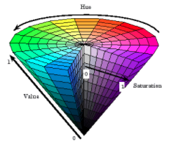
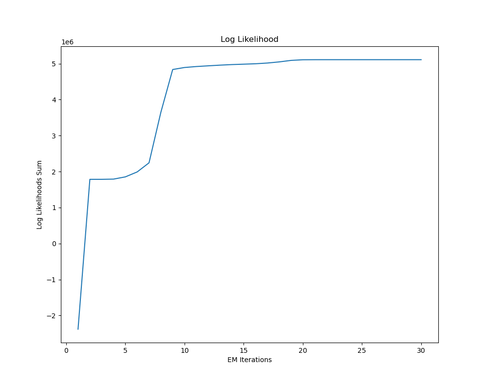

# Detecting Red Barrels

## Introduction:
This assignment required us to train a model that detects red barrels in images. Furthermore, the output had to display the real-world distance of each red barrel from the camera. Building a model with 30 images, each with a respective real-world distance, the outcome had to be generalizable to unseen images of red barrels.

## Problem Statement
The issue with detecting red barrels in various different images is that they are all photographed in different conditions. Changes in lighting or orientation can greatly affect the resulting detection. Furthermore, there are an array of edge cases; such as similarly colored objects in the scene, obstruction of the red barrel, multiple barrels, etc. Ultimately, the aim of this project is to build a model that successfully detects the red barrel(s) in the image, applicable in all photography conditions while still immune to the effects of potential edge cases.

## Approach
I approached tackling this issue by utilizing a Gaussian Mixture Model to best determine whether a pixel represents the highly sought after “red barrel” or not. A GMM model is appropriate in this scenario, as it can be trained to images of different lighting conditions, thus allowing for a more encompassing representation of “red barrel-ness”.

### Deciding On Color Space
I began by deciding on the HSV color space, as opposed to RGB or grayscale. The HSV color space measures colors based on hue, saturation, and value. This is ideal for our purpose, as the red barrel is going to consistently be the same red, with only various lighting conditions affecting the color.
 
For the hue portion of the color space, Reds fall between 0 and 60 degrees. This is helpful as it can easily deduce that colors outside of this hue will not be considered. The saturation and values of red barrels will be what varies based on the differing lighting conditions. In limiting the variations to two features, the model will be better able to fit gaussians.

### Number Of GMMs
The number of GMMs was determined by the two varying features that are going to be taken into consideration. Since the variance is likely to be in the form of saturation and value, using two gaussians in the GMM is logical. 

### Log Likelihood
After running my GMM with 30 EM iterations, I was able to plot a log likelihood graph.

The points on the graph display the increase in log likelihood sum at each EM iteration. According to the plot, a reasonable EM iteration to stop would’ve been 9, seeing as it begins to converge from that point onwards. However, for the assignment, I settled for 7 as I did not plot 30 iterations, and therefore was confused by the behavior leading up to the 9th iteration.

### Thresholds
In order to shape the GMM outputs into desired results, the probabilities had to be further processed. This began with image erosion and dilation with a 7x7 square kernel. The idea was to remove initial noise, then expand boundaries to combine larger masses of red-barrel points. Next, I replaced the image with a binary of 1’s and 0’s depending on whether the point probability was over 99%. This was a method to completely remove further points of noise where classification is not above a specific threshold.
On the regionprops front, I limited recognition of region areas to be above 1200. This was found through measuring the region area of the furthest given red-barrel pic (14 meters). I also limited recognition of the barrels to only accept bounding boxes of a certain width-to-height ratio. This ratio had error built into it, allowing for an acceptable range of detection. That being said, this method invalidates detecting the potential edge case of a barrel sitting horizontally, an edge case which I was willing to forego in order to better a more common detection scenario.

### Distance Measurement
Distance was measured using some initial assumptions. Imagine if a meter-stick was placed in the scene at different known distances. In multiplying the distance by the number of pixels that meter-stick occupied, I arrive at a ratio. This ratio should be consistent across all distances, as the ratio is a linear relationship between distance and the real-world height of each pixel. I applied this analogy to find the ratio of the test images. This was found through the formula of:

Known distance * sqrt(regionArea) = ratio

When I arrived at all the ratios, I simply calculated the mean ratio, which ended up being 493.088, and used it as my ratio for future images. With this ratio, I simply had to refit my previous equation to arrive at a distance:

Distance = ratio / sqrt(regionArea)

## Discussion
This assignment was essentially an exercise in applying GMMs to classify pixels. At its core, I believe I succeeded in building a model and process that applies this concept. The use of the HSV color space and two GMMs allowed me to simplify the problem, while plotting the log-likelihood helped me determine how many iterations of expectation and maximization I should do. Overall, my initial model and processing was capable of identifying red barrels and their distances with the exception of some edge cases.

If I were to do this assignment again, there are several aspects I would tweak to better and more accurately detect red barrels in the image, as well as its real-world distance from the camera.

### Training Images and Pixels
To train this GMM, I utilized RoiPoly to hand draw boundaries of red-barrel pixels. However, this tool introduced a lot of inaccuracies, since it was easy to select pixels outside the barrel, as well as to exclude edge pixels of a barrel where shadows and glare often affected it most. Instead, I would trim the images in photoshop, a much more accurate tool, and import newly cut images as red barrels with transparent backgrounds.

### Cluster Initialization
My method of cluster initialization was by using the global mean of all points, and adding a small amount of noise to each. The sigmas for these also started as identity matrices. This is not ideal as the EM iterations may converge to gather points that should not belong together. Ideally, I would have utilized SciKit-Learn’s k-means function to find the means and sigmas that are most appropriate.

### Amount of EM Iterations
As previously mentioned, I settled for 7 EM iterations, when ideally I should have gone with 9. The odd results at the beginning of the log likelihood curve were off putting, but perhaps due to how the clusters were initialized.

### Probability Processing
I was unable to detect images where the barrel region area was split in two by an obstructing object. One option to get around this edge case is by implementing more iterations of the dilate function. However, the issue that I ran into when doing such was that it affected detection of other noise, which often introduced false positives. Perhaps another option to catch this edge case would have been seeing if the two region areas were aligned in the same direction, or whether their combined area and dimension ratio matched that of a red barrel.

Another point of improvement was my detection of red barrels in varying orientations. A work around for this could have been in using the orientation property of region. This would have allowed me to rotate the bounding box.

### Distance Measurement
My method of distance measurement introduced a lot of room for error, since it depended on finding the right ratio through pixels that are labeled. Having seen plots of these pixels, it is not often the case that the labeled pixels overlap completely with that of the red barrel. Instead, I could have calculated the ratio by measuring the pixel width and heights occupied by red barrels, to compare with known distances. This would have better matched the pinhole camera model that was discussed in class.